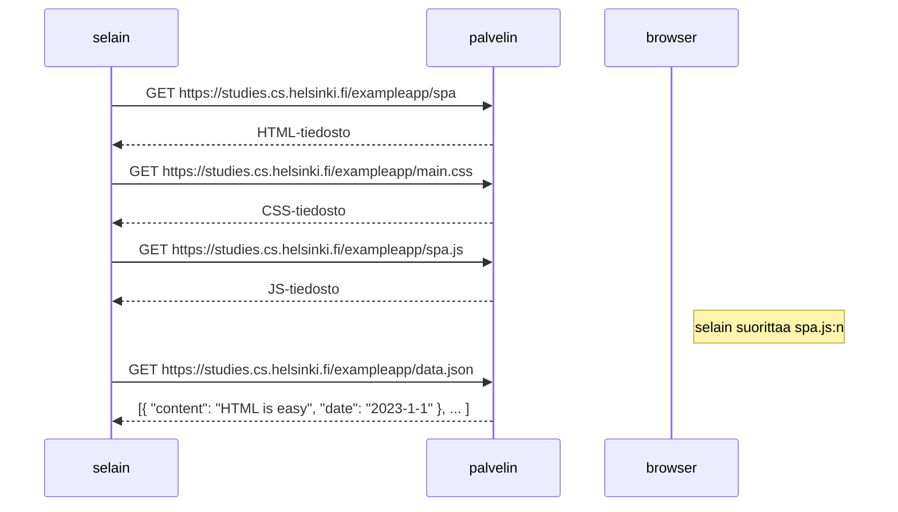

```mermaid
sequenceDiagram
    participant selain
    participant palvelin
    
    selain->>palvelin: GET https://studies.cs.helsinki.fi/exampleapp/spa
    palvelin-->>selain: HTML-tiedosto
    
    selain->>palvelin: GET https://studies.cs.helsinki.fi/exampleapp/main.css
    palvelin-->>selain: CSS-tiedosto
    
    selain->>palvelin: GET https://studies.cs.helsinki.fi/exampleapp/spa.js
    palvelin-->>selain: JS-tiedosto
    
    Note right of browser: selain suorittaa spa.js:n

    selain->>palvelin: GET https://studies.cs.helsinki.fi/exampleapp/data.json
    palvelin-->>selain: [{ "content": "HTML is easy", "date": "2023-1-1" }, ... ]   
```
